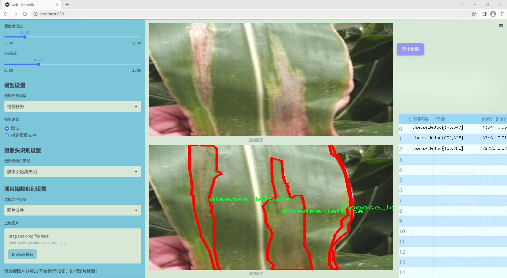
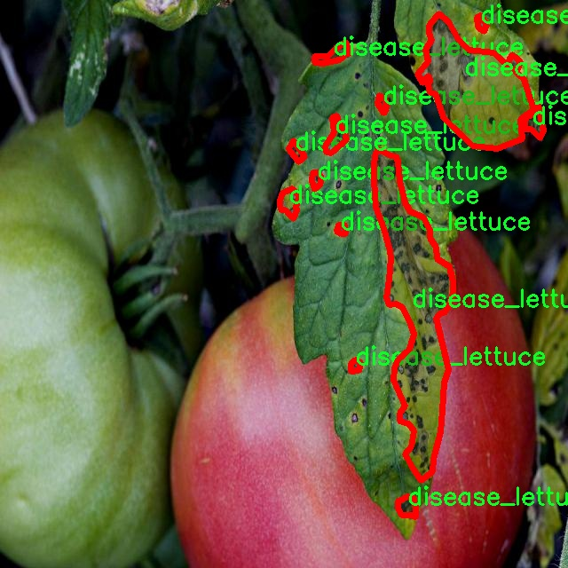

### 1.背景意义

研究背景与意义

随着全球人口的不断增长，农业生产面临着前所未有的挑战，尤其是在资源有限的环境中，如何提高作物的产量和质量成为了亟待解决的问题。水培技术作为一种新兴的农业生产方式，因其高效的水资源利用和较少的土壤病害而受到广泛关注。然而，水培植物同样面临着病害的威胁，尤其是生菜等易受病害影响的作物。因此，开发一种高效的病害检测系统，对于保障水培植物的健康生长、提高农业生产效率具有重要的现实意义。

本研究旨在基于改进的YOLOv11模型，构建一个高效的水培植物病害检测系统。YOLO（You Only Look Once）系列模型因其优越的实时检测能力和高准确率而被广泛应用于计算机视觉领域。通过对YOLOv11进行改进，结合特定的水培植物病害数据集，我们期望能够提升模型在病害检测任务中的性能。该数据集包含1900张图像，涵盖了生菜的正常生长状态与病害状态两大类，能够为模型的训练和评估提供丰富的样本。

在当前的农业科技背景下，利用深度学习技术进行病害检测，不仅可以提高检测的准确性和效率，还能够为农民提供及时的决策支持，减少病害对作物造成的损失。此外，该系统的推广应用将有助于推动智能农业的发展，促进可持续农业的实现。通过本研究，我们希望能够为水培植物的病害管理提供一种新思路，助力农业生产的智能化与现代化进程。

### 2.视频效果

[2.1 视频效果](https://www.bilibili.com/video/BV12hqVYSEy5/)

### 3.图片效果




##### [项目涉及的源码数据来源链接](https://kdocs.cn/l/cszuIiCKVNis)**

注意：本项目提供训练的数据集和训练教程,由于版本持续更新,暂不提供权重文件（best.pt）,请按照6.训练教程进行训练后实现上图演示的效果。

### 4.数据集信息

##### 4.1 本项目数据集类别数＆类别名

nc: 2
names: ['disease_lettuce', 'normal_lettuce']


该项目为【图像分割】数据集，请在【训练教程和Web端加载模型教程（第三步）】这一步的时候按照【图像分割】部分的教程来训练

##### 4.2 本项目数据集信息介绍

本项目数据集信息介绍

本项目所使用的数据集旨在支持改进YOLOv11模型在水培植物病害检测系统中的应用，特别关注于水培生菜的健康状况监测。数据集的主题为“aquaponic_polygan_disease_other”，专注于识别水培环境中生菜的不同状态。该数据集包含两个主要类别，分别为“disease_lettuce”和“normal_lettuce”，这为模型的训练提供了清晰的目标和分类依据。

在水培农业中，生菜作为一种常见的作物，其生长健康与否直接影响到产量和品质。因此，及时识别生菜的病害情况对于农民和农业管理者而言至关重要。本数据集通过大量的图像样本，涵盖了不同生长阶段和环境条件下的生菜图像，确保了数据的多样性和代表性。每个类别的样本均经过精心标注，以便于模型能够准确学习到病害与正常生菜之间的特征差异。

在数据集的构建过程中，特别考虑了水培环境的特殊性，确保图像中能够反映出水培生菜的真实生长状态和潜在病害表现。这种细致的标注和分类将有助于YOLOv11模型在训练过程中有效提取特征，从而提高其在实际应用中的检测精度和效率。通过对该数据集的深入分析和训练，我们期望能够开发出一种高效的病害检测系统，帮助农民实时监控水培生菜的健康状况，降低病害损失，提高农业生产的可持续性。




### 5.全套项目环境部署视频教程（零基础手把手教学）

[5.1 所需软件PyCharm和Anaconda安装教程（第一步）](https://www.bilibili.com/video/BV1BoC1YCEKi/?spm_id_from=333.999.0.0&vd_source=bc9aec86d164b67a7004b996143742dc)


[5.2 安装Python虚拟环境创建和依赖库安装视频教程（第二步）](https://www.bilibili.com/video/BV1ZoC1YCEBw?spm_id_from=333.788.videopod.sections&vd_source=bc9aec86d164b67a7004b996143742dc)

### 6.改进YOLOv11训练教程和Web_UI前端加载模型教程（零基础手把手教学）

[6.1 改进YOLOv11训练教程和Web_UI前端加载模型教程（第三步）](https://www.bilibili.com/video/BV1BoC1YCEhR?spm_id_from=333.788.videopod.sections&vd_source=bc9aec86d164b67a7004b996143742dc)


按照上面的训练视频教程链接加载项目提供的数据集，运行train.py即可开始训练



     Epoch   gpu_mem       box       obj       cls    labels  img_size
     1/200     20.8G   0.01576   0.01955  0.007536        22      1280: 100%|██████████| 849/849 [14:42<00:00,  1.04s/it]
               Class     Images     Labels          P          R     mAP@.5 mAP@.5:.95: 100%|██████████| 213/213 [01:14<00:00,  2.87it/s]
                 all       3395      17314      0.994      0.957      0.0957      0.0843

     Epoch   gpu_mem       box       obj       cls    labels  img_size
     2/200     20.8G   0.01578   0.01923  0.007006        22      1280: 100%|██████████| 849/849 [14:44<00:00,  1.04s/it]
               Class     Images     Labels          P          R     mAP@.5 mAP@.5:.95: 100%|██████████| 213/213 [01:12<00:00,  2.95it/s]
                 all       3395      17314      0.996      0.956      0.0957      0.0845

     Epoch   gpu_mem       box       obj       cls    labels  img_size
     3/200     20.8G   0.01561    0.0191  0.006895        27      1280: 100%|██████████| 849/849 [10:56<00:00,  1.29it/s]
               Class     Images     Labels          P          R     mAP@.5 mAP@.5:.95: 100%|███████   | 187/213 [00:52<00:00,  4.04it/s]
                 all       3395      17314      0.996      0.957      0.0957      0.0845


###### [项目数据集下载链接](https://kdocs.cn/l/cszuIiCKVNis)

### 7.原始YOLOv11算法讲解

##### YOLO11简介

> YOLO11源码地址：https://github.com/ultralytics/ultralytics

Ultralytics
YOLO11是一款尖端的、最先进的模型，它在之前YOLO版本成功的基础上进行了构建，并引入了新功能和改进，以进一步提升性能和灵活性。YOLO11设计快速、准确且易于使用，使其成为各种物体检测和跟踪、实例分割、图像分类以及姿态估计任务的绝佳选择。  


**YOLO11创新点如下:**

YOLO 11主要改进包括：  
`增强的特征提取`：YOLO 11采用了改进的骨干和颈部架构，增强了特征提取功能，以实现更精确的目标检测。  
`优化的效率和速度`：优化的架构设计和优化的训练管道提供更快的处理速度，同时保持准确性和性能之间的平衡。  
`更高的精度，更少的参数`：YOLO11m在COCO数据集上实现了更高的平均精度（mAP），参数比YOLOv8m少22%，使其在不影响精度的情况下提高了计算效率。  
`跨环境的适应性`：YOLO 11可以部署在各种环境中，包括边缘设备、云平台和支持NVIDIA GPU的系统。  
`广泛的支持任务`：YOLO 11支持各种计算机视觉任务，如对象检测、实例分割、图像分类、姿态估计和面向对象检测（OBB）。

**YOLO11不同模型尺寸信息：**

YOLO11 提供5种不同的型号规模模型，以满足不同的应用需求：

Model| size (pixels)| mAPval 50-95| Speed CPU ONNX (ms)| Speed T4 TensorRT10
(ms)| params (M)| FLOPs (B)  
---|---|---|---|---|---|---  
YOLO11n| 640| 39.5| 56.1 ± 0.8| 1.5 ± 0.0| 2.6| 6.5  
YOLO11s| 640| 47.0| 90.0 ± 1.2| 2.5 ± 0.0| 9.4| 21.5  
YOLO11m| 640| 51.5| 183.2 ± 2.0| 4.7 ± 0.1| 20.1| 68.0  
YOLO11l| 640| 53.4| 238.6 ± 1.4| 6.2 ± 0.1| 25.3| 86.9  
YOLO11x| 640| 54.7| 462.8 ± 6.7| 11.3 ± 0.2| 56.9| 194.9  
  
**模型常用训练超参数参数说明：**  
`YOLOv11
模型的训练设置包括训练过程中使用的各种超参数和配置`。这些设置会影响模型的性能、速度和准确性。关键的训练设置包括批量大小、学习率、动量和权重衰减。此外，优化器、损失函数和训练数据集组成的选择也会影响训练过程。对这些设置进行仔细的调整和实验对于优化性能至关重要。  
**以下是一些常用的模型训练参数和说明：**

参数名| 默认值| 说明  
---|---|---  
`model`| `None`| 指定用于训练的模型文件。接受指向 `.pt` 预训练模型或 `.yaml`
配置文件。对于定义模型结构或初始化权重至关重要。  
`data`| `None`| 数据集配置文件的路径（例如
`coco8.yaml`).该文件包含特定于数据集的参数，包括训练数据和验证数据的路径、类名和类数。  
`epochs`| `100`| 训练总轮数。每个epoch代表对整个数据集进行一次完整的训练。调整该值会影响训练时间和模型性能。  
`patience`| `100`| 在验证指标没有改善的情况下，提前停止训练所需的epoch数。当性能趋于平稳时停止训练，有助于防止过度拟合。  
`batch`| `16`| 批量大小，有三种模式:设置为整数(例如，’ Batch =16 ‘)， 60% GPU内存利用率的自动模式(’ Batch
=-1 ‘)，或指定利用率分数的自动模式(’ Batch =0.70 ')。  
`imgsz`| `640`| 用于训练的目标图像尺寸。所有图像在输入模型前都会被调整到这一尺寸。影响模型精度和计算复杂度。  
`device`| `None`| 指定用于训练的计算设备：单个 GPU (`device=0`）、多个 GPU (`device=0,1`)、CPU
(`device=cpu`)，或苹果芯片的 MPS (`device=mps`).  
`workers`| `8`| 加载数据的工作线程数（每 `RANK` 多 GPU 训练）。影响数据预处理和输入模型的速度，尤其适用于多 GPU 设置。  
`name`| `None`| 训练运行的名称。用于在项目文件夹内创建一个子目录，用于存储训练日志和输出结果。  
`pretrained`| `True`| 决定是否从预处理模型开始训练。可以是布尔值，也可以是加载权重的特定模型的字符串路径。提高训练效率和模型性能。  
`optimizer`| `'auto'`| 为训练模型选择优化器。选项包括 `SGD`, `Adam`, `AdamW`, `NAdam`,
`RAdam`, `RMSProp` 等，或 `auto` 用于根据模型配置进行自动选择。影响收敛速度和稳定性  
`lr0`| `0.01`| 初始学习率（即 `SGD=1E-2`, `Adam=1E-3`) .调整这个值对优化过程至关重要，会影响模型权重的更新速度。  
`lrf`| `0.01`| 最终学习率占初始学习率的百分比 = (`lr0 * lrf`)，与调度程序结合使用，随着时间的推移调整学习率。  


**各损失函数作用说明：**  
`定位损失box_loss`：预测框与标定框之间的误差（GIoU），越小定位得越准；  
`分类损失cls_loss`：计算锚框与对应的标定分类是否正确，越小分类得越准；  
`动态特征损失（dfl_loss）`：DFLLoss是一种用于回归预测框与目标框之间距离的损失函数。在计算损失时，目标框需要缩放到特征图尺度，即除以相应的stride，并与预测的边界框计算Ciou
Loss，同时与预测的anchors中心点到各边的距离计算回归DFLLoss。  


### 8.200+种全套改进YOLOV11创新点原理讲解

#### 8.1 200+种全套改进YOLOV11创新点原理讲解大全

由于篇幅限制，每个创新点的具体原理讲解就不全部展开，具体见下列网址中的改进模块对应项目的技术原理博客网址【Blog】（创新点均为模块化搭建，原理适配YOLOv5~YOLOv11等各种版本）

[改进模块技术原理博客【Blog】网址链接](https://gitee.com/qunmasj/good)


#### 8.2 精选部分改进YOLOV11创新点原理讲解

###### 这里节选部分改进创新点展开原理讲解(完整的改进原理见上图和[改进模块技术原理博客链接](https://gitee.com/qunmasj/good)【如果此小节的图加载失败可以通过CSDN或者Github搜索该博客的标题访问原始博客，原始博客图片显示正常】

### 可扩张残差（DWR）注意力模块
当前的许多工作直接采用多速率深度扩张卷积从一个输入特征图中同时捕获多尺度上下文信息，从而提高实时语义分割的特征提取效率。 然而，这种设计可能会因为结构和超参数的不合理而导致多尺度上下文信息的访问困难。 为了降低绘制多尺度上下文信息的难度，我们提出了一种高效的多尺度特征提取方法，该方法分解了原始的单步特征提取方法方法分为两个步骤，区域残差-语义残差。 在该方法中，多速率深度扩张卷积在特征提取中发挥更简单的作用：根据第一步提供的每个简明区域形式特征图，在第二步中使用一个所需的感受野执行简单的基于语义的形态过滤 一步，提高他们的效率。 此外，扩张率和扩张卷积的容量每个网络阶段都经过精心设计，以充分利用所有可以实现的区域形式的特征图。 因此，我们分别为高层和低层网络设计了一种新颖的扩张式残差（DWR）模块和简单倒置残差（SIR）模块。


首先，该博客引入了一个Dilation-wise Residual（DWR）模块，用于提取网络高层的特征，如图2a所示。多分支结构用于扩展感受野，其中每个分支采用不同空洞率的空洞深度卷积。
然后，专门设计了一个Simple Inverted Residual（SIR）模块来提取网络低层的特征，如图2b所示。该模块仅具有3×3的微小感受野，但使用inverted bottleneck式结构来扩展通道数量，确保更强的特征提取能力。
最后，基于DWR和SIR模块，构建了一个编码器-解码器风格的网络DWRSeg，其中解码器采用了简单的类似FCN的结构。解码器使用来自最后两个阶段的强语义信息直接对特征图进行上采样，然后将它们与来自较低阶段的特征图（包含丰富的详细信息）拼接起来，以进行最终预测。


### 9.系统功能展示

图9.1.系统支持检测结果表格显示

  图9.2.系统支持置信度和IOU阈值手动调节

  图9.3.系统支持自定义加载权重文件best.pt(需要你通过步骤5中训练获得)

  图9.4.系统支持摄像头实时识别

  图9.5.系统支持图片识别

  图9.6.系统支持视频识别

  图9.7.系统支持识别结果文件自动保存

  图9.8.系统支持Excel导出检测结果数据


### 10. YOLOv11核心改进源码讲解

#### 10.1 efficientViT.py

以下是对代码的核心部分进行分析和详细注释的结果：

```python
import torch
import torch.nn as nn
import torch.nn.functional as F
import itertools
from timm.models.layers import SqueezeExcite

# 定义一个卷积层和批归一化的组合类
class Conv2d_BN(torch.nn.Sequential):
    def __init__(self, in_channels, out_channels, kernel_size=1, stride=1, padding=0, dilation=1, groups=1, bn_weight_init=1):
        super().__init__()
        # 添加卷积层
        self.add_module('c', torch.nn.Conv2d(in_channels, out_channels, kernel_size, stride, padding, dilation, groups, bias=False))
        # 添加批归一化层
        self.add_module('bn', torch.nn.BatchNorm2d(out_channels))
        # 初始化批归一化的权重
        torch.nn.init.constant_(self.bn.weight, bn_weight_init)
        torch.nn.init.constant_(self.bn.bias, 0)

    @torch.no_grad()
    def switch_to_deploy(self):
        # 将训练模式下的卷积和批归一化合并为一个卷积层
        c, bn = self._modules.values()
        w = bn.weight / (bn.running_var + bn.eps)**0.5  # 计算卷积权重
        w = c.weight * w[:, None, None, None]  # 合并权重
        b = bn.bias - bn.running_mean * bn.weight / (bn.running_var + bn.eps)**0.5  # 计算偏置
        # 创建新的卷积层
        m = torch.nn.Conv2d(w.size(1) * self.c.groups, w.size(0), w.shape[2:], stride=self.c.stride, padding=self.c.padding, dilation=self.c.dilation, groups=self.c.groups)
        m.weight.data.copy_(w)  # 复制权重
        m.bias.data.copy_(b)  # 复制偏置
        return m

# 定义一个用于合并特征图的类
class PatchMerging(torch.nn.Module):
    def __init__(self, dim, out_dim):
        super().__init__()
        hid_dim = int(dim * 4)  # 隐藏层维度
        self.conv1 = Conv2d_BN(dim, hid_dim, 1, 1, 0)  # 1x1卷积
        self.act = torch.nn.ReLU()  # 激活函数
        self.conv2 = Conv2d_BN(hid_dim, hid_dim, 3, 2, 1, groups=hid_dim)  # 3x3卷积
        self.se = SqueezeExcite(hid_dim, .25)  # Squeeze-and-Excitation模块
        self.conv3 = Conv2d_BN(hid_dim, out_dim, 1, 1, 0)  # 1x1卷积

    def forward(self, x):
        # 前向传播
        x = self.conv3(self.se(self.act(self.conv2(self.act(self.conv1(x))))))
        return x

# 定义一个残差连接模块
class Residual(torch.nn.Module):
    def __init__(self, m, drop=0.):
        super().__init__()
        self.m = m  # 子模块
        self.drop = drop  # dropout概率

    def forward(self, x):
        if self.training and self.drop > 0:
            # 在训练时应用dropout
            return x + self.m(x) * torch.rand(x.size(0), 1, 1, 1, device=x.device).ge_(self.drop).div(1 - self.drop).detach()
        else:
            return x + self.m(x)  # 残差连接

# 定义前馈网络模块
class FFN(torch.nn.Module):
    def __init__(self, ed, h):
        super().__init__()
        self.pw1 = Conv2d_BN(ed, h)  # 1x1卷积
        self.act = torch.nn.ReLU()  # 激活函数
        self.pw2 = Conv2d_BN(h, ed, bn_weight_init=0)  # 1x1卷积

    def forward(self, x):
        # 前向传播
        x = self.pw2(self.act(self.pw1(x)))
        return x

# 定义高效的ViT模块
class EfficientViT(torch.nn.Module):
    def __init__(self, img_size=400, patch_size=16, in_chans=3, embed_dim=[64, 128, 192], depth=[1, 2, 3], num_heads=[4, 4, 4]):
        super().__init__()
        # 初始化图像嵌入层
        self.patch_embed = torch.nn.Sequential(
            Conv2d_BN(in_chans, embed_dim[0] // 8, 3, 2, 1),
            torch.nn.ReLU(),
            Conv2d_BN(embed_dim[0] // 8, embed_dim[0] // 4, 3, 2, 1),
            torch.nn.ReLU(),
            Conv2d_BN(embed_dim[0] // 4, embed_dim[0] // 2, 3, 2, 1),
            torch.nn.ReLU(),
            Conv2d_BN(embed_dim[0] // 2, embed_dim[0], 3, 1, 1)
        )

        # 初始化多个块
        self.blocks = []
        for i in range(len(depth)):
            for _ in range(depth[i]):
                self.blocks.append(EfficientViTBlock(embed_dim[i], num_heads[i]))
        self.blocks = torch.nn.Sequential(*self.blocks)

    def forward(self, x):
        # 前向传播
        x = self.patch_embed(x)  # 图像嵌入
        x = self.blocks(x)  # 通过多个块
        return x

# 定义模型构造函数
def EfficientViT_M0(pretrained='', frozen_stages=0, model_cfg=None):
    model = EfficientViT(**model_cfg)  # 创建模型
    if pretrained:
        model.load_state_dict(torch.load(pretrained))  # 加载预训练权重
    return model

# 其他模型构造函数类似
```

### 核心部分分析
1. **卷积层与批归一化的组合**：`Conv2d_BN`类将卷积层和批归一化结合，提供了方便的接口用于构建深度学习模型。
2. **Patch Merging**：`PatchMerging`类通过多个卷积层和Squeeze-and-Excitation模块来处理特征图，增强模型的表达能力。
3. **残差连接**：`Residual`类实现了残差连接，允许信息在网络中更好地流动，缓解了深层网络的训练难度。
4. **前馈网络**：`FFN`类实现了一个简单的前馈神经网络，通常用于特征变换。
5. **高效ViT模型**：`EfficientViT`类是整个模型的核心，负责图像的嵌入和多个块的组合。

### 总结
以上代码实现了一个高效的视觉Transformer（EfficientViT）模型，采用了卷积、批归一化、残差连接和自注意力机制等多种深度学习技术。每个模块都经过精心设计，以提高模型的性能和效率。

这个文件定义了一个名为 `EfficientViT` 的深度学习模型架构，主要用于计算机视觉任务。该模型是基于视觉变换器（Vision Transformer, ViT）的高效版本，旨在提高性能和效率。以下是对代码的逐步分析和说明。

首先，文件导入了必要的库，包括 PyTorch 及其相关模块。`Conv2d_BN` 类是一个自定义的卷积层，结合了卷积操作和批归一化（Batch Normalization），并在初始化时对批归一化的权重进行了常数初始化。它还提供了一个 `switch_to_deploy` 方法，用于在推理阶段将卷积和批归一化合并为一个卷积层，以提高推理速度。

接下来，`replace_batchnorm` 函数用于替换模型中的批归一化层为恒等映射，以便在推理时提高效率。`PatchMerging` 类实现了将输入特征图进行合并的操作，主要用于将特征图的分辨率降低，同时增加通道数。

`Residual` 类实现了残差连接，允许模型在训练时随机丢弃部分信息，以增强模型的鲁棒性。`FFN` 类实现了前馈神经网络（Feed Forward Network），用于特征的进一步处理。

`CascadedGroupAttention` 和 `LocalWindowAttention` 类实现了不同的注意力机制，前者使用级联的组注意力，后者则实现了局部窗口注意力。它们通过对输入特征进行加权来增强模型对重要特征的关注。

`EfficientViTBlock` 类是构建 EfficientViT 的基本模块，结合了卷积、注意力机制和前馈网络。`EfficientViT` 类则是整个模型的主体，包含多个这样的模块，并定义了输入图像的处理流程。

在模型的初始化过程中，定义了多个参数，包括图像大小、补丁大小、嵌入维度、深度、注意力头数等。根据这些参数，模型构建了不同的块，并通过 `patch_embed` 将输入图像转换为补丁表示。

文件中还定义了多个不同配置的 EfficientViT 模型（如 `EfficientViT_m0` 到 `EfficientViT_m5`），每个配置都有不同的参数设置，以适应不同的任务需求。

最后，文件提供了一些函数（如 `EfficientViT_M0` 等）用于创建具体的模型实例，并可以选择加载预训练权重和替换批归一化层。`update_weight` 函数用于更新模型的权重字典，确保加载的权重与模型结构相匹配。

在 `__main__` 部分，示例代码展示了如何实例化一个模型并对输入进行前向传播，输出各层的特征图大小。这部分代码主要用于测试和验证模型的功能。

总体而言，这个文件实现了一个高效的视觉变换器模型，结合了多种深度学习技术，以提高计算机视觉任务的性能和效率。

#### 10.2 starnet.py

以下是经过简化和注释的代码，保留了最核心的部分：

```python
import torch
import torch.nn as nn
from timm.models.layers import DropPath, trunc_normal_

# 定义一个卷积层和批归一化层的组合
class ConvBN(torch.nn.Sequential):
    def __init__(self, in_planes, out_planes, kernel_size=1, stride=1, padding=0, dilation=1, groups=1, with_bn=True):
        super().__init__()
        # 添加卷积层
        self.add_module('conv', torch.nn.Conv2d(in_planes, out_planes, kernel_size, stride, padding, dilation, groups))
        # 如果需要，添加批归一化层
        if with_bn:
            self.add_module('bn', torch.nn.BatchNorm2d(out_planes))
            # 初始化批归一化层的权重和偏置
            torch.nn.init.constant_(self.bn.weight, 1)
            torch.nn.init.constant_(self.bn.bias, 0)

# 定义StarNet中的基本块
class Block(nn.Module):
    def __init__(self, dim, mlp_ratio=3, drop_path=0.):
        super().__init__()
        # 深度可分离卷积
        self.dwconv = ConvBN(dim, dim, 7, 1, (7 - 1) // 2, groups=dim, with_bn=True)
        # 线性变换
        self.f1 = ConvBN(dim, mlp_ratio * dim, 1, with_bn=False)
        self.f2 = ConvBN(dim, mlp_ratio * dim, 1, with_bn=False)
        self.g = ConvBN(mlp_ratio * dim, dim, 1, with_bn=True)
        self.dwconv2 = ConvBN(dim, dim, 7, 1, (7 - 1) // 2, groups=dim, with_bn=False)
        self.act = nn.ReLU6()  # 激活函数
        self.drop_path = DropPath(drop_path) if drop_path > 0. else nn.Identity()  # 随机深度

    def forward(self, x):
        input = x  # 保存输入
        x = self.dwconv(x)  # 深度可分离卷积
        x1, x2 = self.f1(x), self.f2(x)  # 线性变换
        x = self.act(x1) * x2  # 元素级乘法
        x = self.dwconv2(self.g(x))  # 再次卷积
        x = input + self.drop_path(x)  # 残差连接
        return x

# 定义StarNet模型
class StarNet(nn.Module):
    def __init__(self, base_dim=32, depths=[3, 3, 12, 5], mlp_ratio=4, drop_path_rate=0.0, num_classes=1000):
        super().__init__()
        self.num_classes = num_classes
        self.in_channel = 32
        # stem层
        self.stem = nn.Sequential(ConvBN(3, self.in_channel, kernel_size=3, stride=2, padding=1), nn.ReLU6())
        dpr = [x.item() for x in torch.linspace(0, drop_path_rate, sum(depths))]  # 随机深度
        # 构建各个阶段
        self.stages = nn.ModuleList()
        cur = 0
        for i_layer in range(len(depths)):
            embed_dim = base_dim * 2 ** i_layer  # 计算当前层的嵌入维度
            down_sampler = ConvBN(self.in_channel, embed_dim, 3, 2, 1)  # 下采样
            self.in_channel = embed_dim
            blocks = [Block(self.in_channel, mlp_ratio, dpr[cur + i]) for i in range(depths[i_layer])]  # 添加Block
            cur += depths[i_layer]
            self.stages.append(nn.Sequential(down_sampler, *blocks))  # 添加到阶段

    def forward(self, x):
        features = []
        x = self.stem(x)  # 通过stem层
        features.append(x)
        for stage in self.stages:
            x = stage(x)  # 通过每个阶段
            features.append(x)
        return features  # 返回特征

# 创建不同规模的StarNet模型
def starnet_s1(pretrained=False, **kwargs):
    model = StarNet(24, [2, 2, 8, 3], **kwargs)
    return model

def starnet_s2(pretrained=False, **kwargs):
    model = StarNet(32, [1, 2, 6, 2], **kwargs)
    return model

def starnet_s3(pretrained=False, **kwargs):
    model = StarNet(32, [2, 2, 8, 4], **kwargs)
    return model

def starnet_s4(pretrained=False, **kwargs):
    model = StarNet(32, [3, 3, 12, 5], **kwargs)
    return model
```

### 代码注释说明：
1. **ConvBN类**：定义了一个包含卷积层和批归一化层的组合，便于构建网络的卷积部分。
2. **Block类**：实现了StarNet的基本计算单元，包含深度可分离卷积、线性变换和元素级乘法的操作，使用残差连接来保留输入信息。
3. **StarNet类**：构建整个网络结构，包括stem层和多个阶段，每个阶段由下采样和多个Block组成。
4. **模型创建函数**：提供了不同规模的StarNet模型创建函数，便于用户根据需求选择合适的模型。

这个程序文件实现了一个名为StarNet的神经网络模型，主要用于图像处理任务。文件开头的文档字符串简要说明了StarNet的设计理念，强调了其简化的网络结构，以突出逐元素乘法的关键贡献。该模型没有使用层缩放和训练过程中的指数移动平均（EMA），这些设计选择可能会进一步提升性能。

程序首先导入了必要的库，包括PyTorch和一些自定义的层。接着定义了一个包含不同StarNet模型的列表，以便于后续调用。模型的预训练权重链接也被存储在一个字典中，方便加载。

接下来，定义了一个名为`ConvBN`的类，它是一个组合层，包含卷积层和可选的批归一化层。该类的构造函数接受多个参数来配置卷积操作，并在初始化时对批归一化的权重和偏置进行了常数初始化。

然后定义了`Block`类，代表StarNet中的基本构建块。每个块包含深度卷积、两个全连接层（通过`ConvBN`实现）和一个逐元素乘法操作。激活函数使用ReLU6，最后通过残差连接将输入与输出相加，并应用随机深度的丢弃路径。

`StarNet`类是整个网络的核心，构造函数中定义了网络的结构，包括一个初始的stem层和多个阶段。每个阶段由下采样层和多个`Block`组成。通过计算每个阶段的输出通道数，确保网络在前向传播时能够正确处理特征。

在`StarNet`类中，还定义了一个权重初始化方法，使用截断正态分布初始化卷积和线性层的权重，并对归一化层的偏置和权重进行初始化。

最后，文件提供了多个函数（如`starnet_s1`、`starnet_s2`等），用于创建不同规模的StarNet模型，并可以选择性地加载预训练权重。这些函数通过传递不同的参数来构建不同配置的StarNet实例。

总体来说，这个程序文件实现了一个灵活且可扩展的StarNet模型，适用于各种图像处理任务，并提供了预训练模型的加载功能。

#### 10.3 dyhead_prune.py

以下是经过简化和注释的核心代码部分：

```python
import torch
import torch.nn as nn
import torch.nn.functional as F

class DyReLU(nn.Module):
    """动态ReLU激活函数，能够根据输入动态调整激活值。
    
    Args:
        inp (int): 输入通道数。
        reduction (int): 通道压缩比例。
        lambda_a (float): 动态调整参数。
        K2 (bool): 是否使用偏置。
        use_bias (bool): 是否使用偏置。
        use_spatial (bool): 是否使用空间注意力。
        init_a (list): 初始化参数a的值。
        init_b (list): 初始化参数b的值。
    """
    
    def __init__(self, inp, reduction=4, lambda_a=1.0, K2=True, use_bias=True, use_spatial=False,
                 init_a=[1.0, 0.0], init_b=[0.0, 0.0]):
        super(DyReLU, self).__init__()
        self.oup = inp  # 输出通道数
        self.lambda_a = lambda_a * 2  # 动态调整参数
        self.K2 = K2  # 是否使用偏置
        self.avg_pool = nn.AdaptiveAvgPool2d(1)  # 自适应平均池化

        # 根据是否使用偏置设置exp的值
        self.exp = 4 if use_bias else 2 if K2 else 2 if use_bias else 1
        
        # 确定压缩比例
        squeeze = inp // reduction if reduction == 4 else _make_divisible(inp // reduction, 4)

        # 定义全连接层
        self.fc = nn.Sequential(
            nn.Linear(inp, squeeze),
            nn.ReLU(inplace=True),
            nn.Linear(squeeze, self.oup * self.exp),
            h_sigmoid()  # 使用h_sigmoid作为激活函数
        )
        
        # 如果使用空间注意力，定义相应的卷积层
        self.spa = nn.Sequential(
            nn.Conv2d(inp, 1, kernel_size=1),
            nn.BatchNorm2d(1),
        ) if use_spatial else None

    def forward(self, x):
        """前向传播函数。"""
        # 如果输入是列表，分离输入和输出
        x_in = x[0] if isinstance(x, list) else x
        x_out = x[1] if isinstance(x, list) else x
        
        b, c, h, w = x_in.size()  # 获取输入的尺寸
        y = self.avg_pool(x_in).view(b, c)  # 自适应平均池化并调整形状
        y = self.fc(y).view(b, self.oup * self.exp, 1, 1)  # 通过全连接层并调整形状
        
        # 根据exp的值计算输出
        if self.exp == 4:
            a1, b1, a2, b2 = torch.split(y, self.oup, dim=1)
            a1 = (a1 - 0.5) * self.lambda_a + self.init_a[0]
            a2 = (a2 - 0.5) * self.lambda_a + self.init_a[1]
            b1 = b1 - 0.5 + self.init_b[0]
            b2 = b2 - 0.5 + self.init_b[1]
            out = torch.max(x_out * a1 + b1, x_out * a2 + b2)
        elif self.exp == 2:
            a1, b1 = torch.split(y, self.oup, dim=1)
            a1 = (a1 - 0.5) * self.lambda_a + self.init_a[0]
            b1 = b1 - 0.5 + self.init_b[0]
            out = x_out * a1 + b1
        elif self.exp == 1:
            a1 = y
            a1 = (a1 - 0.5) * self.lambda_a + self.init_a[0]
            out = x_out * a1

        # 如果使用空间注意力，计算空间注意力并调整输出
        if self.spa:
            ys = self.spa(x_in).view(b, -1)
            ys = F.softmax(ys, dim=1).view(b, 1, h, w) * h * w
            ys = F.hardtanh(ys, 0, 3, inplace=True) / 3
            out = out * ys

        return out

class DyDCNv2(nn.Module):
    """带有归一化层的ModulatedDeformConv2d，用于DyHead。
    
    Args:
        in_channels (int): 输入通道数。
        out_channels (int): 输出通道数。
        stride (int | tuple[int], optional): 卷积的步幅。
        norm_cfg (dict, optional): 归一化层的配置字典。
    """
    
    def __init__(self, in_channels, out_channels, stride=1, norm_cfg=dict(type='GN', num_groups=16, requires_grad=True)):
        super().__init__()
        self.with_norm = norm_cfg is not None  # 是否使用归一化
        bias = not self.with_norm  # 如果不使用归一化，则使用偏置
        self.conv = ModulatedDeformConv2d(in_channels, out_channels, 3, stride=stride, padding=1, bias=bias)  # 定义可调变形卷积
        if self.with_norm:
            self.norm = build_norm_layer(norm_cfg, out_channels)[1]  # 构建归一化层

    def forward(self, x, offset, mask):
        """前向传播函数。"""
        x = self.conv(x.contiguous(), offset, mask)  # 进行卷积操作
        if self.with_norm:
            x = self.norm(x)  # 如果使用归一化，则进行归一化
        return x
```

### 代码说明：
1. **DyReLU**: 这是一个动态ReLU激活函数的实现，能够根据输入的特征动态调整激活值。它通过自适应平均池化和全连接层来生成动态参数，并可以选择性地使用空间注意力。

2. **DyDCNv2**: 这是一个带有归一化层的可调变形卷积模块，主要用于特征提取。它根据输入的特征图和偏移量、掩码进行卷积操作，并在需要时应用归一化。

这两个类是深度学习模型中用于特征提取和激活的核心组件，能够增强模型的表达能力和性能。

这个程序文件 `dyhead_prune.py` 实现了一些深度学习中的模块，主要用于动态头（Dynamic Head）模型的构建，特别是在目标检测和图像分割等任务中。代码使用了 PyTorch 框架，并引入了一些额外的库，如 `mmcv` 和 `mmengine`，用于构建激活层和归一化层。

首先，文件中定义了一个 `_make_divisible` 函数，该函数用于确保某个值能够被指定的除数整除，并且不会小于最小值的 90%。这个函数在调整网络结构时非常有用，特别是在处理通道数时。

接下来，定义了几个激活函数的类，包括 `swish`、`h_swish` 和 `h_sigmoid`。这些类都继承自 `nn.Module`，并实现了 `forward` 方法，以便在前向传播中使用。`swish` 是一种新型激活函数，`h_swish` 和 `h_sigmoid` 则是高斯激活函数的变种，通常用于深度学习模型中以提高性能。

然后，定义了 `DyReLU` 类，这是一个动态 ReLU 激活函数的实现。该类通过自适应的方式调整激活函数的参数，以适应输入特征的不同。构造函数中设置了一些参数，如输入通道数、缩减比例、是否使用偏置等。`forward` 方法根据输入特征计算输出，支持不同的输出方式，包括使用空间注意力机制。

接着，定义了 `DyDCNv2` 类，这是一个带有归一化层的可调变形卷积层。该类的构造函数接受输入和输出通道数、步幅以及归一化配置，并在前向传播中应用变形卷积和归一化。

最后，定义了 `DyHeadBlock_Prune` 类，这是一个包含三种注意力机制的动态头块。构造函数中初始化了多个卷积层和注意力模块。`forward` 方法负责计算偏移量和掩码，并根据输入特征的不同层次进行卷积操作，结合高、中、低层特征以生成最终的输出。

整体来看，这个文件实现了一个复杂的动态头结构，利用动态激活函数和可调变形卷积来增强模型的表达能力，适用于需要多尺度特征融合的深度学习任务。

#### 10.4 CTrans.py

以下是代码中最核心的部分，并附上详细的中文注释：

```python
import torch
import torch.nn as nn
import numpy as np
from torch.nn import Dropout, Softmax, Conv2d, LayerNorm

class Channel_Embeddings(nn.Module):
    """构建来自图像块和位置的嵌入"""
    def __init__(self, patchsize, img_size, in_channels):
        super().__init__()
        img_size = (img_size, img_size)  # 将图像大小转换为元组
        patch_size = (patchsize, patchsize)  # 将补丁大小转换为元组
        n_patches = (img_size[0] // patch_size[0]) * (img_size[1] // patch_size[1])  # 计算补丁数量

        # 使用最大池化和卷积层构建补丁嵌入
        self.patch_embeddings = nn.Sequential(
            nn.MaxPool2d(kernel_size=5, stride=5),
            Conv2d(in_channels=in_channels,
                    out_channels=in_channels,
                    kernel_size=patchsize // 5,
                    stride=patchsize // 5)
        )

        # 位置嵌入参数
        self.position_embeddings = nn.Parameter(torch.zeros(1, n_patches, in_channels))
        self.dropout = Dropout(0.1)  # Dropout层，防止过拟合

    def forward(self, x):
        """前向传播函数"""
        if x is None:
            return None
        x = self.patch_embeddings(x)  # 计算补丁嵌入
        x = x.flatten(2)  # 将特征展平
        x = x.transpose(-1, -2)  # 转置以适应后续操作
        embeddings = x + self.position_embeddings  # 添加位置嵌入
        embeddings = self.dropout(embeddings)  # 应用Dropout
        return embeddings

class Attention_org(nn.Module):
    """自定义的多头注意力机制"""
    def __init__(self, vis, channel_num):
        super(Attention_org, self).__init__()
        self.vis = vis  # 可视化标志
        self.KV_size = sum(channel_num)  # 键值对的总大小
        self.channel_num = channel_num  # 通道数量
        self.num_attention_heads = 4  # 注意力头的数量

        # 初始化查询、键、值的线性变换
        self.query = nn.ModuleList([nn.Linear(c, c, bias=False) for c in channel_num])
        self.key = nn.Linear(self.KV_size, self.KV_size, bias=False)
        self.value = nn.Linear(self.KV_size, self.KV_size, bias=False)

        self.psi = nn.InstanceNorm2d(self.num_attention_heads)  # 实例归一化
        self.softmax = Softmax(dim=3)  # Softmax层
        self.attn_dropout = Dropout(0.1)  # 注意力的Dropout
        self.proj_dropout = Dropout(0.1)  # 投影的Dropout

    def forward(self, *embeddings):
        """前向传播函数"""
        multi_head_Q = [query(emb) for query, emb in zip(self.query, embeddings) if emb is not None]
        multi_head_K = self.key(torch.cat(embeddings, dim=2))  # 计算键
        multi_head_V = self.value(torch.cat(embeddings, dim=2))  # 计算值

        # 计算注意力分数
        attention_scores = [torch.matmul(Q, multi_head_K) / np.sqrt(self.KV_size) for Q in multi_head_Q]
        attention_probs = [self.softmax(self.psi(score)) for score in attention_scores]

        # 应用Dropout
        attention_probs = [self.attn_dropout(prob) for prob in attention_probs]

        # 计算上下文层
        context_layers = [torch.matmul(prob, multi_head_V) for prob in attention_probs]

        # 投影输出
        outputs = [self.proj_dropout(layer) for layer in context_layers]
        return outputs

class ChannelTransformer(nn.Module):
    """通道变换器模型"""
    def __init__(self, channel_num=[64, 128, 256, 512], img_size=640, vis=False, patchSize=[40, 20, 10, 5]):
        super().__init__()
        self.embeddings = nn.ModuleList([Channel_Embeddings(patchSize[i], img_size // (2 ** (i + 2)), channel_num[i]) for i in range(len(channel_num))])
        self.encoder = Encoder(vis, channel_num)  # 编码器
        self.reconstruct = nn.ModuleList([Reconstruct(channel_num[i], channel_num[i], kernel_size=1, scale_factor=(patchSize[i], patchSize[i])) for i in range(len(channel_num))])

    def forward(self, en):
        """前向传播函数"""
        embeddings = [embed(en[i]) for i, embed in enumerate(self.embeddings) if en[i] is not None]
        encoded = self.encoder(*embeddings)  # 编码
        reconstructed = [recon(enc) + en[i] for i, (recon, enc) in enumerate(zip(self.reconstruct, encoded)) if en[i] is not None]
        return reconstructed
```

### 代码说明：
1. **Channel_Embeddings**：该类负责将输入图像转换为补丁嵌入，并添加位置嵌入。使用最大池化和卷积层来提取特征。
2. **Attention_org**：实现了多头注意力机制，计算输入嵌入的注意力分数，并返回上下文层。支持可视化注意力权重。
3. **ChannelTransformer**：整个模型的核心，负责将输入的多个通道嵌入进行编码和重构。通过调用嵌入层和编码器来处理输入数据。

这个程序文件 `CTrans.py` 实现了一个基于通道变换器（Channel Transformer）的深度学习模型，主要用于图像处理任务。代码中定义了多个类，每个类实现了模型的不同组成部分。以下是对代码的详细说明。

首先，文件导入了一些必要的库，包括 PyTorch、NumPy 和一些深度学习模块。接着，定义了几个主要的类。

`Channel_Embeddings` 类用于构建图像的嵌入表示。它接收图像的尺寸和通道数，并通过卷积和池化操作将图像划分为多个补丁。每个补丁会生成一个嵌入向量，并且类中还包含位置嵌入以保留空间信息。前向传播方法将输入图像转换为嵌入表示，并添加位置嵌入。

`Reconstruct` 类用于重建图像。它接收嵌入向量并通过上采样和卷积操作将其转换回图像的空间维度。这个类的前向传播方法会对输入进行变换并返回重建后的图像。

`Attention_org` 类实现了多头注意力机制。它接收多个嵌入并计算注意力权重，使用线性变换将查询、键和值映射到适当的维度。通过计算注意力分数并应用 softmax 函数，类可以生成加权的上下文向量。

`Mlp` 类实现了一个简单的多层感知机（MLP），用于对嵌入进行非线性变换。它包含两个全连接层和一个激活函数（GELU），并且在每个层后都有 dropout 操作以防止过拟合。

`Block_ViT` 类实现了一个变换器块，结合了注意力机制和前馈网络。它首先对输入进行层归一化，然后通过注意力机制处理嵌入，最后通过 MLP 进行进一步的变换。这个类的前向传播方法返回经过处理的嵌入和注意力权重。

`Encoder` 类由多个 `Block_ViT` 组成，负责将输入的嵌入通过多个变换器块进行编码。它同样对嵌入进行层归一化，并在每个块中收集注意力权重。

`ChannelTransformer` 类是整个模型的核心。它初始化了多个嵌入层、编码器和重建层。前向传播方法接收输入的图像，生成嵌入，经过编码器处理后再进行重建。最终输出的图像是对输入图像的重建结果。

最后，`GetIndexOutput` 类用于从模型的输出中提取特定索引的结果，方便后续处理。

总体来说，这个程序实现了一个通道变换器模型，结合了卷积、注意力机制和多层感知机等技术，适用于图像处理任务。通过分层结构和模块化设计，代码具有良好的可读性和可扩展性。

### 11.完整训练+Web前端界面+200+种全套创新点源码、数据集获取


# [下载链接：https://mbd.pub/o/bread/Z5yYk5dw](https://mbd.pub/o/bread/Z5yYk5dw)